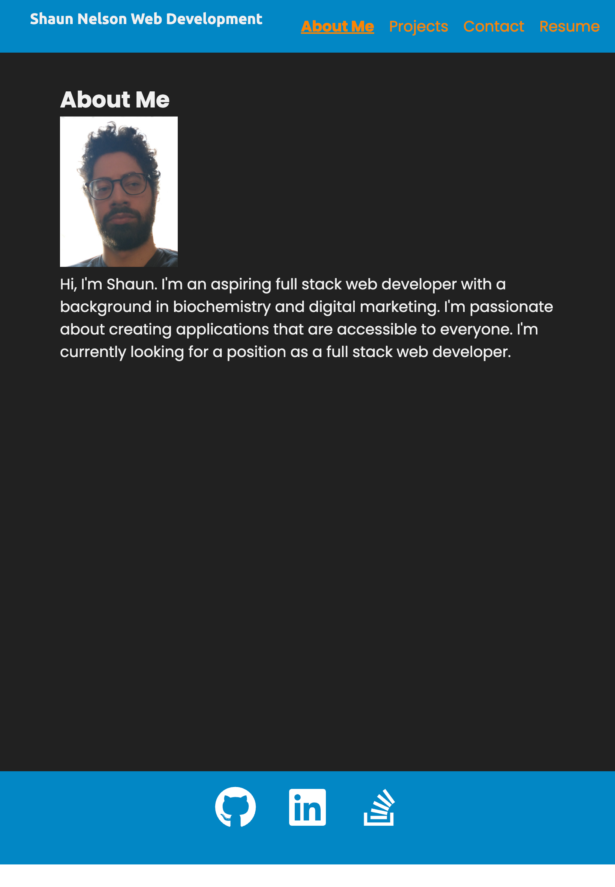

# React Portfolio

## Table of Contents

- [React Portfolio](#react-portfolio)
  - [Table of Contents](#table-of-contents)
  - [Description](#description)
  - [GitHub Repository](#github-repository)
  - [Preview Screenshot](#preview-screenshot)
  - [Credits](#credits)
  - [License](#license)

## Description

A portfolio built with React which includes the following pages: About Me, Projects, Contact, and Resume. The About Me page includes a short bio and a picture of me. The Projects page includes a list of projects I have worked on. The Contact page includes a form to contact me. The Resume page includes a link to my resume.

## GitHub Repository

https://github.com/Shaun-Nelson/react-portfolio

## Preview Screenshot

## Credits

https://reactrouter.com/en/main/start/overview
https://reactrouter.com/en/6.14.2/components/nav-link
https://react-icons.github.io/react-icons/
https://create-react-app.dev/docs/deployment/

## License

MIT License

Copyright (c) 2023 Shaun Nelson

Permission is hereby granted, free of charge, to any person obtaining a copy
of this software and associated documentation files (the "Software"), to deal
in the Software without restriction, including without limitation the rights
to use, copy, modify, merge, publish, distribute, sublicense, and/or sell
copies of the Software, and to permit persons to whom the Software is
furnished to do so, subject to the following conditions:

The above copyright notice and this permission notice shall be included in all
copies or substantial portions of the Software.

THE SOFTWARE IS PROVIDED "AS IS", WITHOUT WARRANTY OF ANY KIND, EXPRESS OR
IMPLIED, INCLUDING BUT NOT LIMITED TO THE WARRANTIES OF MERCHANTABILITY,
FITNESS FOR A PARTICULAR PURPOSE AND NONINFRINGEMENT. IN NO EVENT SHALL THE
AUTHORS OR COPYRIGHT HOLDERS BE LIABLE FOR ANY CLAIM, DAMAGES OR OTHER
LIABILITY, WHETHER IN AN ACTION OF CONTRACT, TORT OR OTHERWISE, ARISING FROM,
OUT OF OR IN CONNECTION WITH THE SOFTWARE OR THE USE OR OTHER DEALINGS IN THE
SOFTWARE.
